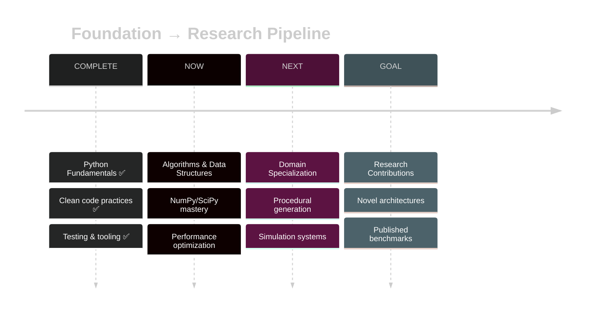

# 📊 README Progress Update Guide

## Daily/Weekly Update System

Your README stays alive and reflects real progress. Here's how to update it as you complete modules:

---

## 🔄 Quick Update Checklist

### Every Time You Complete Something:

1. **Update Progress Percentage**
2. **Change Module Status**
3. **Update Commit Count**
4. **Add Completed Projects**
5. **Update Current Module Section**
6. **Add Demo Clips (Weekly)**

---

## 📝 Specific Updates by Section

### 1. **Progress Bar & Stats** (Top of README)

```markdown
<!-- BEFORE: Week 0 -->


**0% Complete** • **0/14 Modules** • **0 Commits** • **Just Getting Started**

<!-- AFTER: Completed Hello World -->


**7% Complete** • **1/14 Modules** • **12 Commits** • **Building Momentum**

<!-- AFTER: Completed 5 modules -->


**36% Complete** • **5/14 Modules** • **47 Commits** • **Halfway Through Foundation**
```

**Formula:** `percentage = (completed_modules / 14) * 100`

---

### 2. **Module Status Table**

```markdown
<!-- BEFORE -->
| 1 | **Hello World** | 1 | 1 | 2 | 2 | 🔴 Not Started |

<!-- AFTER: Started -->
| 1 | **Hello World** | 1 | 1 | 2 | 2 | 🟡 In Progress |

<!-- AFTER: Completed -->
| 1 | **Hello World** | 1 | 1 | 2 | 2 | ✅ Complete |

<!-- Next module unlocks -->
| 2 | **Control Flow** | 2 | 1 | 2 | 1 | 🔴 Not Started |
```

**Status Indicators:**
- 🔴 Not Started
- 🟡 In Progress  
- ✅ Complete
- ⬜ Locked

---

### 3. **Current Module Section**

Move this section as you progress:

```markdown
<!-- WEEK 1: Hello World -->
## 🚀 CURRENT MODULE: HELLO WORLD


**Progress:** 7/14 concepts practiced

<!-- WEEK 2: Control Flow -->
## 🚀 CURRENT MODULE: CONTROL FLOW


**Progress:** 3/12 concepts practiced

<!-- Add previous module to "Recently Completed" -->
### ✅ Recently Completed: Hello World
- Block Letters project ⭐
- Lovely Loveseats POS system ⭐
- [View code →](./01-hello-world/)
```

---

### 4. **Projects Showcase Section**

Add completed projects with screenshots/demos:

```markdown
## 🎨 PROJECT SHOWCASE

### ✅ Completed Projects

<table>
<tr>
<td width="50%" valign="top">

#### 📦 Lovely Loveseats POS
**Module:** Hello World • **Week:** 1


**Features:**
- Item pricing system
- Tax calculation
- Receipt generation
- Clean CLI interface

**Tech:** Python basics, f-strings, arithmetic

[View Code →](./01-hello-world/lovely_loveseats.py) • [Tests →](./01-hello-world/tests/)

</td>
<td width="50%" valign="top">

#### 🔤 Block Letters Generator
**Module:** Hello World • **Week:** 1


**Features:**
- ASCII art generation
- Custom text input
- Multiple styles
- Clean formatting

**Tech:** String manipulation, print formatting

[View Code →](./01-hello-world/block_letters.py) • [Tests →](./01-hello-world/tests/)

</td>
</tr>

<!-- Add new row for next 2 projects -->
<tr>
<td width="50%" valign="top">

#### 🎮 Magic 8-Ball
**Module:** Control Flow • **Week:** 2


**Features:**
- Random responses
- User input handling
- Conditional logic
- Interactive CLI

**Tech:** if/elif/else, random module

[View Code →](./02-control-flow/magic_8_ball.py)

</td>
<td width="50%" valign="top">

#### 🚦 Sal's Shipping Calculator
**Module:** Control Flow • **Week:** 2


**Features:**
- Weight-based pricing
- Multi-option comparison
- Cost optimization
- Input validation

**Tech:** Conditional logic, comparison operators

[View Code →](./02-control-flow/sals_shipping.py)

</td>
</tr>
</table>
```

---

### 5. **Weekly Progress Log** (New Section to Add)

Create a dedicated progress tracking section:

```markdown
## 📈 WEEKLY PROGRESS LOG

<details open>
<summary><b>🗓️ Week 3: January 15-21, 2026</b></summary>

### This Week's Achievements
- ✅ Completed Control Flow module
- ✅ Built Magic 8-Ball project
- ✅ Built Sal's Shipping Calculator  
- ✅ Started Lists module
- 📝 15 commits this week
- ⏱️ 8 hours of focused work

### Key Learnings
- Conditional logic patterns
- Boolean operators mastery
- Error handling basics
- Writing cleaner if/elif chains

### Challenges & Solutions
**Challenge:** Nested conditionals getting messy  
**Solution:** Learned early returns and guard clauses

### Next Week Goals
- Complete Lists module
- Master list comprehensions
- Build grocery list tracker
- Add 80% test coverage

</details>

<details>
<summary><b>🗓️ Week 2: January 8-14, 2026</b></summary>

### This Week's Achievements
- ✅ Completed Hello World module
- ✅ Built Block Letters generator
- ✅ Built Lovely Loveseats POS
- 📝 12 commits this week
- ⏱️ 6 hours of focused work

### Key Learnings
- Python syntax fundamentals
- Variable naming conventions
- F-string formatting
- Basic arithmetic operations

### Next Week Goals
- Start Control Flow module
- Learn conditional logic
- Build interactive programs

</details>

<details>
<summary><b>🗓️ Week 1: January 1-7, 2026</b></summary>

### This Week's Achievements
- 🎯 Set up repository
- 🎯 Configured development environment
- 🎯 Created README structure
- 🎯 Started Codecademy course
- 📝 3 commits this week

### Key Learnings
- Git workflow setup
- Python virtual environments
- Professional repo structure

### Next Week Goals
- Complete Hello World module
- Build first two projects
- Set up testing framework

</details>
```

---

### 6. **Stats Section Update**

Add a live stats section:

```markdown
## 📊 BY THE NUMBERS

<div align="center">

<table>
<tr>
<td align="center">
<h3>📚</h3>
<h2>5/14</h2>
<p>Modules Completed</p>
</td>
<td align="center">
<h3>💻</h3>
<h2>10/14</h2>
<p>Projects Built</p>
</td>
<td align="center">
<h3>✅</h3>
<h2>12/13</h2>
<p>Quizzes Passed</p>
</td>
<td align="center">
<h3>🔥</h3>
<h2>47</h2>
<p>Day Streak</p>
</td>
</tr>
<tr>
<td align="center">
<h3>⏱️</h3>
<h2>62h</h2>
<p>Total Hours</p>
</td>
<td align="center">
<h3>📝</h3>
<h2>156</h2>
<p>Commits</p>
</td>
<td align="center">
<h3>🧪</h3>
<h2>87%</h2>
<p>Test Coverage</p>
</td>
<td align="center">
<h3>⭐</h3>
<h2>36%</h2>
<p>Course Progress</p>
</td>
</tr>
</table>

</div>
```

---

### 7. **Mermaid Timeline Update**

Update the progression timeline:

```markdown

```

---

## 🤖 Automation Options

### Option 1: Manual Updates (Simple)
Edit README.md directly after each module completion

### Option 2: Python Script (Recommended)

Create `update_progress.py`:

```python
#!/usr/bin/env python3
"""
README Progress Updater
Automatically updates progress metrics in README
"""

import re
from datetime import datetime
from pathlib import Path

class ProgressUpdater:
    def __init__(self):
        self.readme_path = Path("README.md")
        self.readme_content = self.readme_path.read_text()
        
    def update_progress_bar(self, completed: int, total: int = 14):
        """Update the progress bar percentage"""
        percentage = int((completed / total) * 100)
        
        # Find and replace progress bar
        pattern = r'https://geps\.dev/progress/\d+'
        replacement = f'https://geps.dev/progress/{percentage}'
        self.readme_content = re.sub(pattern, replacement, self.readme_content)
        
    def update_stats(self, modules: int, commits: int, status: str):
        """Update completion statistics"""
        pattern = r'\*\*\d+% Complete\*\* • \*\*\d+/14 Modules\*\* • \*\*\d+ Commits\*\* • \*\*.*?\*\*'
        percentage = int((modules / 14) * 100)
        replacement = f'**{percentage}% Complete** • **{modules}/14 Modules** • **{commits} Commits** • **{status}**'
        self.readme_content = re.sub(pattern, replacement, self.readme_content)
        
    def update_module_status(self, module_num: int, status: str):
        """Update module status in table"""
        # Status options: "🔴 Not Started", "🟡 In Progress", "✅ Complete"
        pattern = rf'(\| {module_num} \| \*\*.*?\*\* \| \d+ \| \d+ \| \d+ \| \d+ \|) [🔴🟡✅⬜].*? \|'
        replacement = rf'\1 {status} |'
        self.readme_content = re.sub(pattern, replacement, self.readme_content)
    
    def save(self):
        """Save updated README"""
        self.readme_path.write_text(self.readme_content)
        print("✅ README updated successfully!")

# Usage
if __name__ == "__main__":
    updater = ProgressUpdater()
    
    # Example: Just completed module 1
    updater.update_progress_bar(completed=1)
    updater.update_stats(modules=1, commits=12, status="Building Momentum")
    updater.update_module_status(module_num=1, status="✅ Complete")
    updater.update_module_status(module_num=2, status="🟡 In Progress")
    
    updater.save()
```

Run after each module:
```bash
python update_progress.py
```

### Option 3: GitHub Actions (Advanced)

Create `.github/workflows/update-readme.yml`:

```yaml
name: Update README Stats

on:
  push:
    branches: [main]
  schedule:
    - cron: '0 0 * * 0'  # Weekly on Sunday

jobs:
  update:
    runs-on: ubuntu-latest
    steps:
      - uses: actions/checkout@v3
      
      - name: Set up Python
        uses: actions/setup-python@v4
        with:
          python-version: '3.11'
      
      - name: Update progress
        run: |
          python scripts/update_progress.py
      
      - name: Commit changes
        run: |
          git config --local user.email "action@github.com"
          git config --local user.name "GitHub Action"
          git add README.md
          git commit -m "📊 Update progress [skip ci]" || echo "No changes"
          git push
```

---

## 📅 Update Schedule

### After Each Work Session:
- Git commit with descriptive message
- Update project files

### After Each Module Completion:
- ✅ Update progress bar
- ✅ Update module status table
- ✅ Move "Current Module" section
- ✅ Update stats numbers
- ✅ Add completed projects to showcase

### Weekly (Every Friday):
- 📸 Take demo screenshots/GIFs
- 📝 Write weekly progress log entry
- 📊 Update "By The Numbers" stats
- 🎯 Set next week's goals
- 🔄 Push all updates to GitHub

### Monthly:
- 📈 Review overall progress
- 🎨 Add any new visual elements
- 📚 Update learning resources section
- 🎯 Adjust timeline if needed

---

## 🎨 Demo Creation Tips

### For Screenshots:
```bash
# Use for CLI apps
script -c "python your_project.py" demo.txt
# Convert to image with Carbon.now.sh or Terminalizer
```

### For GIFs:
```bash
# Use Terminalizer
npm install -g terminalizer
terminalizer record demo
terminalizer render demo

# Or use asciinema
asciinema rec demo.cast
asciinema play demo.cast
```

### For Screen Recordings:
- **Mac:** QuickTime, CMD+Shift+5
- **Linux:** SimpleScreenRecorder, Kazam
- **Windows:** OBS Studio
- **Convert to GIF:** `ffmpeg -i demo.mp4 -vf "fps=10,scale=800:-1" demo.gif`

---

## 💡 Pro Tips

1. **Keep a PROGRESS.md** separate from README for detailed logs
2. **Commit often** with clear messages: `git commit -m "✅ Complete Hello World module"`
3. **Use conventional commits**: `feat:`, `fix:`, `docs:`, `test:`
4. **Screenshot everything** - you'll want visuals later
5. **Update immediately** - don't let updates pile up
6. **Version your README** - can always roll back if needed

---

## 🔄 Quick Update Template

Keep this checklist handy:

```markdown
## Module Completion Checklist

- [ ] Update progress bar percentage
- [ ] Change module status to ✅ Complete
- [ ] Unlock next module (change ⬜ to 🔴)
- [ ] Update stats (modules, commits, status message)
- [ ] Move "Current Module" to next module
- [ ] Add projects to showcase section
- [ ] Take screenshots/GIFs of projects
- [ ] Write weekly log entry (if Friday)
- [ ] Update "By The Numbers" stats
- [ ] Commit and push changes
- [ ] Tweet progress (optional but recommended!)
```

---

## 🎯 Example Update Flow

```bash
# 1. Just completed Control Flow module
git add .
git commit -m "✅ Complete Control Flow module - Magic 8-Ball & Shipping Calculator"

# 2. Update README
python scripts/update_progress.py --module 2 --status complete

# 3. Take demo screenshots
terminalizer record magic8ball-demo
terminalizer render magic8ball-demo

# 4. Add demos to showcase
mv magic8ball-demo.gif demos/

# 5. Push everything
git add README.md demos/
git commit -m "📊 Update README - Control Flow complete (14% → 21%)"
git push origin main

# 6. (Optional) Tweet progress
echo "Just completed Control Flow in my Python foundations! 🎉
✅ Magic 8-Ball
✅ Shipping Calculator  
21% through the course - building toward GRAIL-tier research capabilities 🚀"
```

---

Your README becomes a **living document** that grows with you! 🚀
