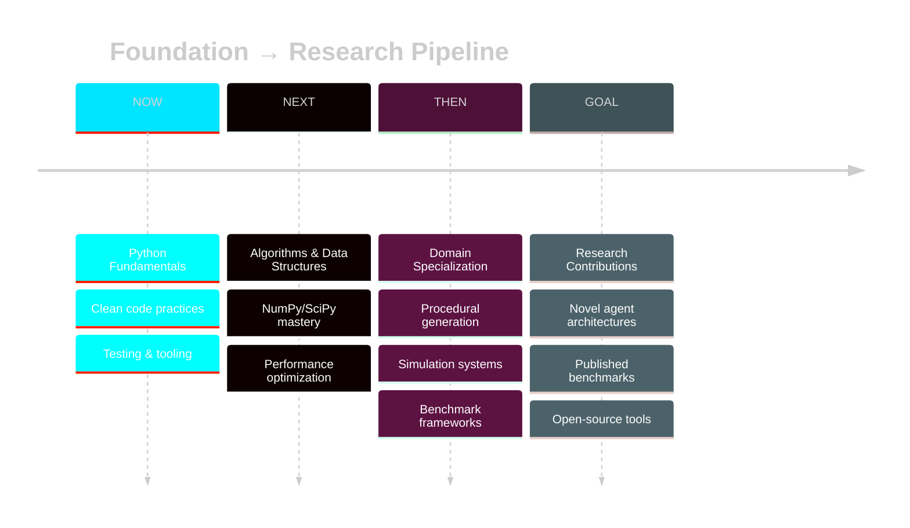

```mermaid
%%{init: {'theme':'dark', 'themeVariables': { 'primaryColor':'#22C55E','primaryTextColor':'#fff','primaryBorderColor':'#00E5FF','lineColor':'#7C3AED'}}}%%
graph LR
    A[Hello World] --> B[Control Flow]
    B --> C[Lists]
    C --> D[Loops]
    D --> E[Functions]
    E --> F[Strings]
    F --> G[Modules]
    G --> H[Dictionaries]
    H --> I[Files]
    I --> J[Classes]
    J --> K[Research Ready]
    
    style A fill:#22C55E,stroke:#22C55E,stroke-width:3px,color:#000
    style K fill:#00E5FF,stroke:#00E5FF,stroke-width:3px,color:#000
```

<div align="center">

<!-- Animated header with gradient -->


<!-- Typing animation -->
<a href="https://git.io/typing-svg">
  
</a>

</a>

<br/>

<!-- Status badges -->
<p>
  
  
  
  
</p>

</div>

---

<br/>

## 🎯 MISSION

<div align="center">

```python
class PythonJourney:
    """From zero to research-grade capabilities"""
    
    def __init__(self):
        self.current_level = 0
        self.target = "uw_grail_tier_research"
        self.approach = "foundations_first"
        
    @property
    def focus_areas(self):
        return [
            "procedural_world_generation",
            "simulation_systems",
            "evaluation_benchmarks", 
            "long_horizon_memory_planning"
        ]
    
    def philosophy(self):
        return "Master the basics. Build on rock, not sand."

journey = PythonJourney()
assert journey.current_level == 0, "Everyone starts somewhere"
assert journey.target == "uw_grail_tier_research", "Aim high"
```

</div>

This repository documents my journey through **Python 3.12 fundamentals** via Codecademy's Learn Python 3 course. These aren't just exercises—they're the foundation for advanced work in procedural generation, simulations, and AI agent systems.

<br/>

---

<br/>

## 📊 COURSE OVERVIEW

<div align="center">

<table>
<tr>
<td align="center" width="25%">

<br/><b>Certificate</b>
<br/>Earn completion cert
</td>
<td align="center" width="25%">

<br/><b>14 Projects</b>
<br/>Hands-on coding
</td>
<td align="center" width="25%">

<br/><b>14 Lessons</b>
<br/>Core concepts
</td>
<td align="center" width="25%">

<br/><b>Beginner</b>
<br/>Friendly pace
</td>
</tr>
</table>

<br/>

**Learn Python 3.12** — One of the most powerful, versatile, and in-demand programming languages today.

<!-- Progress bar -->


<br/><br/>

**3% Complete** • **0/13 Modules** • **0 Commits** • **Building Momentum**

</div>

<br/>

---

<br/>

## 🗺️ CURRICULUM ROADMAP

<div align="center">



</div>

<br/>

<details open>
<summary><b>📚 MODULE BREAKDOWN</b></summary>

<br/>

| # | Module | Lessons | Quizzes | Projects | Articles | Status |
|---|--------|---------|---------|----------|----------|--------|
| 1 | **Hello World** | 1 | 1 | 2 | 2 | 🟡 In Progress |
| 2 | **Control Flow** | 2 | 1 | 2 | 1 | ⬜ Locked |
| 3 | **Lists** | 2 | 2 | 2 | 2 | ⬜ Locked |
| 4 | **Loops** | 1 | 1 | 1 | 0 | ⬜ Locked |
| 5 | **Functions** | 1 | 1 | 1 | 2 | ⬜ Locked |
| 6 | **Code Challenges I** | 0 | 0 | 0 | 7 | ⬜ Locked |
| 7 | **Strings** | 2 | 2 | 2 | 0 | ⬜ Locked |
| 8 | **Modules** | 1 | 1 | 1 | 1 | ⬜ Locked |
| 9 | **Dictionaries** | 2 | 2 | 1 | 1 | ⬜ Locked |
| 10 | **Files** | 1 | 1 | 1 | 0 | ⬜ Locked |
| 11 | **Classes** | 1 | 1 | 1 | 0 | ⬜ Locked |
| 12 | **Code Challenges II** | 0 | 0 | 0 | 5 | ⬜ Locked |
| 13 | **Next Steps** | 0 | 0 | 0 | 1 | ⬜ Locked |

<br/>

**Total:** 14 Lessons • 13 Quizzes • 14 Projects • 22 Articles

</details>

<br/>

---

<br/>

## 🚀 CURRENT MODULE: HELLO WORLD

<div align="center">


<br/><br/>

**Get started with Python syntax and create a point of sale system for a furniture store**

</div>

### 📋 Module Contents

```yaml
lesson:
  title: "Hello World"
  focus: "Python syntax fundamentals"
  concepts:
    - print() function
    - Comments
    - Variables
    - Data types
    - Basic arithmetic

quiz:
  title: "Hello World Quiz"
  questions: 10
  passing_score: 80%

projects:
  - name: "Block Letters"
    type: "ASCII Art Generator"
    skills: [strings, print, creativity]
  
  - name: "Receipts for Lovely Loveseats"
    type: "Point of Sale System"
    skills: [variables, arithmetic, formatting]

articles:
  - "Make the Most of Your Codecademy Membership"
  - "User Input in Python"
```

<div align="center">

**Progress:** Lesson ✅ • Quiz ✅ • Practice 0/14 • Projects ⬜⬜

<br/>

<a href="#"></a>

</div>

<br/>

---

<br/>

## 🎨 ENHANCED PROJECT STANDARDS

<div align="center">

**Not Just Completing Exercises — Building Production-Quality Code**

</div>

Every course project will be **upgraded beyond requirements** with:

<table>
<tr>
<td width="50%" valign="top">

### ⚡ Code Quality
- ✅ Type hints (`mypy` compliant)
- ✅ Docstrings (Google style)
- ✅ Clean code patterns
- ✅ Error handling
- ✅ PEP 8 compliance (`black` + `ruff`)

</td>
<td width="50%" valign="top">

### 🧪 Testing & Tools
- ✅ Unit tests (`pytest`)
- ✅ Test coverage (>80%)
- ✅ CLI interfaces (`click`)
- ✅ Git commits with conventional style
- ✅ README documentation

</td>
</tr>
</table>

<div align="center">

**Goal:** Learn fundamentals while practicing professional development habits

</div>

<br/>

---

<br/>

## 🛠️ DEVELOPMENT STACK

<div align="center">


<br/>

**Core Tools**
```yaml
language: Python 3.12+
testing: pytest + coverage
formatting: black + ruff
type_checking: mypy
version_control: git + conventional commits
```

</div>

<br/>

---

<br/>

## 🎯 LONG-TERM VISION

<div align="center">

```ascii
┌─────────────────────────────────────────────────────────────┐
│                                                             │
│  These Python basics aren't the destination.               │
│  They're the foundation for:                               │
│                                                             │
│  🌍  Procedural World Generation                           │
│      → Terrain synthesis, architecture grammars            │
│                                                             │
│  🔬  Simulation & Benchmarks                               │
│      → Physics engines, evaluation harnesses               │
│                                                             │
│  🤖  Long-Horizon AI Agents                                │
│      → Memory systems, multi-step planning                 │
│                                                             │
│  Every complex system starts with simple building blocks.  │
│                                                             │
└─────────────────────────────────────────────────────────────┘
```

</div>

<br/>

### 📈 Progression Path



<br/>

---

<br/>

## 📚 REPOSITORY STRUCTURE

```
python-foundations-lab/
│
├── 01-hello-world/
│   ├── lesson_notes.md
│   ├── block_letters.py
│   ├── lovely_loveseats.py
│   ├── tests/
│   └── README.md
│
├── 02-control-flow/
│   ├── lesson_notes.md
│   ├── projects/
│   ├── tests/
│   └── README.md
│
├── 03-lists/
├── 04-loops/
├── 05-functions/
├── 06-strings/
├── 07-modules/
├── 08-dictionaries/
├── 09-files/
├── 10-classes/
│
├── challenges/          # Optional code challenges
├── demos/              # Demo clips & screenshots
├── docs/               # Learning notes & references
│
├── .github/
│   └── workflows/      # CI/CD for tests
│
├── pyproject.toml      # Project configuration
├── README.md
└── PROGRESS.md         # Detailed progress log
```

<br/>

---

<br/>

## 🏆 LEARNING PRINCIPLES

<div align="center">

<table>
<tr>
<td align="center" width="33%">

### 🎯 Depth Over Speed
Don't just complete—**understand**
<br/><br/>
Every concept thoroughly grasped
<br/>
No rushing to the finish line

</td>
<td align="center" width="33%">

### 🔨 Build Everything
Learn by **implementing**
<br/><br/>
Write code, don't just read
<br/>
Type every example yourself

</td>
<td align="center" width="33%">

### 📝 Document Relentlessly
**Future me** needs context
<br/><br/>
Explain decisions and lessons
<br/>
Leave breadcrumbs for later

</td>
</tr>
</table>

</div>

<br/>

---

<br/>

## 📊 PROGRESS TRACKING

<div align="center">

### Weekly Execution Protocol

</div>

```yaml
monday:
  - Review previous module
  - Plan current module objectives
  - Set weekly goals

tue_thursday:
  - Complete lessons & quizzes
  - Build & enhance projects
  - Write comprehensive tests
  - Document learnings

friday:
  - Code review & refactor
  - Update progress log
  - Commit week's work

weekend:
  - Reflect on concepts
  - Explore advanced topics
  - Prepare for next module
```

<div align="center">

**Commitment:** Consistent progress every week, documented and shipped

</div>

<br/>

---

<br/>

## 🎓 RESOURCES & REFERENCES

<details>
<summary><b>📖 Course Materials</b></summary>

<br/>

- [Codecademy: Learn Python 3](https://www.codecademy.com/learn/learn-python-3)
- [Python 3.12 Official Documentation](https://docs.python.org/3.12/)
- Course cheatsheets and articles (saved in `/docs`)

</details>

<details>
<summary><b>🛠️ Development Tools</b></summary>

<br/>

**Code Quality**
- [Black](https://black.readthedocs.io/) - Code formatter
- [Ruff](https://docs.astral.sh/ruff/) - Fast Python linter
- [mypy](https://mypy.readthedocs.io/) - Static type checker

**Testing**
- [pytest](https://docs.pytest.org/) - Testing framework
- [coverage.py](https://coverage.readthedocs.io/) - Code coverage

**Documentation**
- [Google Python Style Guide](https://google.github.io/styleguide/pyguide.html)
- [Real Python](https://realpython.com/) - Tutorials and guides

</details>

<details>
<summary><b>🔗 Future Learning Path</b></summary>

<br/>

**After Course Completion:**
1. Data Structures & Algorithms
2. NumPy & Scientific Computing
3. Testing & Software Engineering Best Practices
4. Procedural Generation Algorithms
5. Simulation & Game Engine Fundamentals

</details>

<br/>

---

<br/>

## 💡 WHY THIS MATTERS

<div align="center">

```ascii
╔═══════════════════════════════════════════════════════════════╗
║                                                               ║
║  "The best researchers aren't just smart—they're disciplined" ║
║                                                               ║
║  Every complex system starts with fundamentals:              ║
║                                                               ║
║  • Writing efficient simulation code                         ║
║  • Understanding algorithm complexity                        ║
║  • Building scalable research systems                        ║
║  • Contributing to cutting-edge AI research                  ║
║                                                               ║
║  This repository is proof of that discipline.                ║
║                                                               ║
╚═══════════════════════════════════════════════════════════════╝
```

</div>

<br/>

---

<br/>

<div align="center">

## 🚀 STATUS

<br/>

**Current Phase:** Foundation Building (Week 1)

**Next Milestone:** Complete Hello World Module

**Target:** UW GRAIL-Tier Research Capabilities

<br/>

```python
# The journey begins with a single line
print("Hello, World!")
```

<br/>

---


<br/>

**Started:** January 2026 • **Status:** In Progress • **Destination:** Research Excellence

<br/>

*"The journey of a thousand miles begins with a single step."*

</div>
