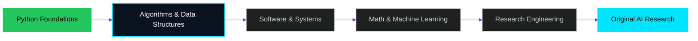
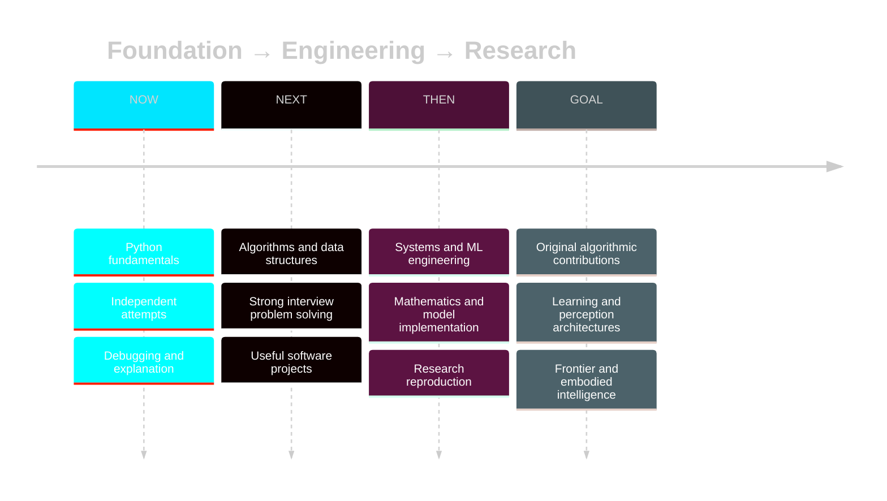

<div align="center">

<!-- Animated header with gradient -->


<!-- Typing animation -->
<a href="https://git.io/typing-svg">
  
</a>

<br/>

<!-- Status badges -->
<p>
  
  
  
  
</p>

</div>

---

<br/>

## 🎯 MISSION

<div align="center">

```python
class PythonJourney:
    """From zero to research-grade capabilities"""

    def __init__(self):
        self.current_level = 0
        self.target = "uw_grail_tier_research"
        self.approach = "foundations_first"

    @property
    def focus_areas(self):
        return [
            "procedural_world_generation",
            "simulation_systems",
            "evaluation_benchmarks",
            "long_horizon_memory_planning"
        ]

    def philosophy(self):
        return "Master the basics. Build on rock, not sand."

journey = PythonJourney()
assert journey.current_level == 0, "Everyone starts somewhere"
assert journey.target == "uw_grail_tier_research", "Aim high"
```

</div>

This repository documents my ascent from **Python fundamentals** toward strong software engineering and **original AI research**. GPT web guides the lessons; I write, run, and debug real code in VS Code. Each attempt, correction, and explanation becomes part of the work underneath that ambition.

<div align="center">

<a href="docs/WORKFLOW.md"></a>
<a href="exercises/0001-find-index/prompt.md"></a>
<a href="PROGRESS.md"></a>

</div>

<br/>

---

<br/>

## 📊 LEARNING ARENA

<div align="center">

<table>
<tr>
<td align="center" width="25%">

<br/><b>Write & Build</b>
<br/>Real Python in VS Code
</td>
<td align="center" width="25%">

<br/><b>Learn & Explain</b>
<br/>GPT web stays the tutor
</td>
<td align="center" width="25%">

<br/><b>Keep the Evidence</b>
<br/>Attempts, fixes, reasoning
</td>
<td align="center" width="25%">

<br/><b>Grow Toward Research</b>
<br/>Algorithms · systems · AI
</td>
</tr>
</table>

<br/>

**Current focus:** Functions + list search • **Practice:** Untimed construction • **Next:** Complexity + pairs

</div>

<details>
<summary><b>📚 Earlier Codecademy checkpoint</b></summary>

<br/>

<div align="center">


**18% course progress · 2/13 modules** — preserved from the earlier course record.

</div>

The original course materials and progress guide remain in the [archive](archive/codecademy-2026-09-19/ARCHIVE.md). This historical course percentage is separate from the current practice record.

</details>

<br/>

---

<br/>

## 🗺️ CURRICULUM ROADMAP

<div align="center">


```mermaid
%%{init: {'theme':'dark', 'themeVariables': { 'primaryColor':'#22C55E','primaryTextColor':'#fff','primaryBorderColor':'#00E5FF','lineColor':'#7C3AED'}}}%%
graph LR
    A[Python Foundations] --> B[Algorithms & Data Structures]
    B --> C[Software & Systems]
    C --> D[Math & Machine Learning]
    D --> E[Research Engineering]
    E --> F[Original AI Research]
    style A fill:#22C55E,stroke:#22C55E,stroke-width:3px,color:#000
    style B fill:#0b1220,stroke:#00E5FF,stroke-width:2px,color:#fff
    style F fill:#00E5FF,stroke:#00E5FF,stroke-width:3px,color:#000
```

</div>

<br/>

<details open>
<summary><b>📚 THE BUILDING BLOCKS</b></summary>

<br/>

| Layer | What I am building | Evidence to preserve | Stage |
|---|---|---|---|
| **Python foundations** | State, control flow, collections, functions | Attempts, predictions, repairs, changed requirements | 🟡 Active |
| **Algorithms** | Correctness, complexity, data structures, optimization | Derived solutions, explanations, unseen variations | ⬜ Ahead |
| **Software & systems** | Useful programs, interfaces, concurrency, distributed behavior | Runnable projects, tests, design tradeoffs | ⬜ Ahead |
| **Math & ML** | Linear algebra, probability, optimization, model implementation | Derivations, training loops, reproducible experiments | ⬜ Ahead |
| **Research engineering** | Reproduction, experimental design, measurement | Baselines, discrepancies, ablations, limitations | ⬜ Ahead |
| **Original research** | New learning, reasoning, perception, or systems methods | Defensible contributions and reproducible results | 🎯 Destination |

[Explore the full capability roadmap →](docs/ROADMAP.md)

</details>

<br/>

---

<br/>

## 🚀 CURRENT MODULE: FUNCTIONS + SEARCH

<div align="center">


<br/><br/>

**Build a reusable search function from the written requirements.**

</div>

### 📋 On the Workbench

```yaml
exercise: "0001 — Find an index"
focus: "Combine functions, parameters, list traversal, and a returned result"
status: "Unfinished learner draft"
practice: "Independent construction attempt, untimed"
next: "Search variations → complexity → pairs → Two Sum"
```

<div align="center">

<a href="exercises/0001-find-index/prompt.md"></a>
<a href="exercises/0001-find-index/attempt.py"></a>
<a href="exercises/0001-find-index/notes.md"></a>

</div>

<br/>

The preceding reusable-search trace was completed in the tutoring conversation. This construction exercise is still in progress. [The learning record](PROGRESS.md) keeps demonstrated work and future goals separate.

<br/>

---

<br/>

## 🎨 ENHANCED PROJECT STANDARDS

<div align="center">

**Build understanding into the code — then make the work easy to inspect.**

</div>

<table>
<tr>
<td width="50%" valign="top">

### ⚡ Engineering Craft
- Understand and clarify the requirements
- Write an approach I can explain
- Debug failures and account for edge cases
- Analyze costs as the algorithms grow
- Improve structure as projects become larger

</td>
<td width="50%" valign="top">

### 🧪 Evidence & Iteration
- Preserve original attempts and revisions
- Record the help used on each attempt
- Check behavior with meaningful examples
- Return to skills after a delay
- Publish reproducible work and its limitations

</td>
</tr>
</table>

<div align="center">

[**Selected work & project writeups →**](portfolio/README.md)

</div>

<br/>

---

<br/>

## 🛠️ DEVELOPMENT STACK

<div align="center">


<br/>

**GPT web teaches · VS Code is the workbench · Git preserves the work**

</div>

```yaml
language: Python 3.14
workspace: Dedicated Learning Arena profile
daily_tutor: Existing GPT web conversation
review: Copy the exact attempt with Ctrl+Alt+C
execution: Python runner + breakpoint debugging
history: Saved attempts + explicit Git checkpoints
```

<details>
<summary><b>⚙️ Open & use the arena</b></summary>

<br/>

1. Open **Open Learning Arena.cmd** on the workstation.
2. Write in `attempt.py`, with the prompt visible alongside it.
3. Use **Copy attempt for tutor**, then paste into the existing GPT web chat.
4. Run or debug when the lesson calls for it; keep predictions in `notes.md`.
5. Save a local checkpoint and push when ready to share the work.

For another Windows machine with VS Code, Git, and uv installed, run `powershell -ExecutionPolicy Bypass -File tools/install.ps1` once.

[Daily workflow](docs/WORKFLOW.md) · [GitHub connection](docs/GITHUB.md) · [Tutor handoff](docs/TUTOR_HANDOFF.md)

</details>

<br/>

---

<br/>

## 🎯 LONG-TERM VISION

<div align="center">

```text
╔══════════════════════════════════════════════════════════╗
║                                                          ║
║          BUILDING BLOCKS → FRONTIER INTELLIGENCE           ║
║                                                          ║
║   Algorithms & optimization                              ║
║       → Better ways to solve computational problems       ║
║                                                          ║
║   Learning, reasoning & perception                       ║
║       → Models, agents, memory, multimodal intelligence   ║
║                                                          ║
║   Systems & embodied intelligence                        ║
║       → Reliable infrastructure and intelligent robots    ║
║                                                          ║
║       Every layer earns its strength from the one below.  ║
║                                                          ║
╚══════════════════════════════════════════════════════════╝
```

</div>

<br/>

### 📈 Progression Path


```mermaid
%%{init: {'theme':'dark', 'themeVariables': { 'primaryColor':'#00E5FF','primaryTextColor':'#fff'}}}%%
timeline
    title Foundation → Engineering → Research
    NOW : Python fundamentals
        : Independent attempts
        : Debugging and explanation
    NEXT : Algorithms and data structures
         : Strong interview problem solving
         : Useful software projects
    THEN : Systems and ML engineering
         : Mathematics and model implementation
         : Research reproduction
    GOAL : Original algorithmic contributions
         : Learning and perception architectures
         : Frontier and embodied intelligence
```

Strong SWE, systems, ML engineering, research internships, and open-source work can each contribute to this path. The work grows from the current foundation, one demonstrated capability at a time.

<br/>

---

<br/>

## 📚 REPOSITORY STRUCTURE

```text
python-foundations-lab/
│
├── exercises/
│   └── 0001-find-index/
│       ├── prompt.md          # The tutor's current task
│       ├── attempt.py         # My unfinished attempt
│       └── notes.md           # Predictions and reasoning
│
├── portfolio/                # Selected substantial work as it develops
├── docs/                     # Workflow, roadmap, and tutor handoff
├── tools/                    # Learning Arena extension and helpers
├── .vscode/                  # Python, debugging, and practice settings
├── .github/workflows/        # Checks for the arena tooling
├── archive/                  # Original Codecademy materials
│
├── Open Learning Arena.cmd   # Open the dedicated practice workspace
├── CURRENT.json              # Current exercise
├── PROGRESS.md               # Learning evidence and next steps
└── README.md
```

Private tutor links, raw feedback, and local execution output stay in the Git-ignored `.arena/` folder.

<br/>

---

<br/>

## 🏆 LEARNING PRINCIPLES

<div align="center">

<table>
<tr>
<td align="center" width="33%">

### 🎯 Depth Over Speed
Don't just complete—**understand**
<br/><br/>
Every concept thoroughly grasped
<br/>
No rushing to the finish line

</td>
<td align="center" width="33%">

### 🔨 Build Everything
Learn by **implementing**
<br/><br/>
Write code, don't just read
<br/>
Type every example yourself

</td>
<td align="center" width="33%">

### 📝 Document Relentlessly
**Future me** needs context
<br/><br/>
Explain decisions and lessons
<br/>
Leave breadcrumbs for later

</td>
</tr>
</table>

</div>

<br/>

---

<br/>

## 📊 PROGRESS TRACKING

<div align="center">

### The Practice Loop

</div>

```yaml
begin:
  - Recall prior work
  - Read the current requirement
  - Make an independent attempt

work:
  - Predict and explain
  - Run when appropriate
  - Diagnose the failure
  - Repair and try a meaningful variation

reflect:
  - Record help and discoveries
  - Preserve the attempt and revision
  - Set the next delayed revisit
  - Save a meaningful checkpoint
```

<div align="center">

[**📖 Learning record**](PROGRESS.md) • [**🧭 Roadmap**](docs/ROADMAP.md) • [**🔨 Repository history**](https://github.com/LLParis/python-foundations-lab/commits/main)

**Commitment:** Consistent practice, growing independence, and work I can explain.

</div>

<br/>

---

<br/>

## 🎓 RESOURCES & REFERENCES

<details>
<summary><b>📖 Learning & continuity</b></summary>

<br/>

- [Current exercise](exercises/0001-find-index/prompt.md)
- [Learning context and current checkpoint](docs/LEARNING_CONTEXT.md)
- [Capability roadmap](docs/ROADMAP.md)
- [Python 3.14 documentation](https://docs.python.org/3.14/)
- [Earlier Codecademy materials](archive/codecademy-2026-09-19/ARCHIVE.md)

</details>

<details>
<summary><b>🛠️ Workspace & tools</b></summary>

<br/>

- [Daily workflow](docs/WORKFLOW.md)
- [GitHub and GPT web connection](docs/GITHUB.md)
- [One-time tutor handoff](docs/TUTOR_HANDOFF.md)
- [Local extension source](tools/vscode-extension/)
- [Setup sources](docs/SOURCES.md)

</details>

<details>
<summary><b>🔎 Authorship & evidence</b></summary>

<br/>

The workspace tooling and documentation were built with Codex assistance. Exercise attempts and reasoning are attributed separately; the first attempt is my unchanged, unfinished draft from GPT web. Tooling checks do not count as completed lessons. Assistance, retained skills, and timed performance are recorded through actual work.

[Portfolio writeup format](portfolio/TEMPLATE.md) · [Current learning evidence](PROGRESS.md)

</details>

<br/>

---

<br/>

## 💡 WHY THIS MATTERS

<div align="center">

```ascii
╔═══════════════════════════════════════════════════════════════╗
║                                                               ║
║  "The best researchers aren't just smart—they're disciplined" ║
║                                                               ║
║  Every complex system starts with fundamentals:              ║
║                                                               ║
║  • Writing efficient simulation code                         ║
║  • Understanding algorithm complexity                        ║
║  • Building scalable research systems                        ║
║  • Contributing to cutting-edge AI research                  ║
║                                                               ║
║  This repository records that discipline in practice.                ║
║                                                               ║
╚═══════════════════════════════════════════════════════════════╝
```

</div>

<br/>

---

<br/>

<div align="center">

## 🚀 STATUS

<br/>
**Current Phase:** Python Foundations — Functions + Search
**Next Milestone:** Independent reusable search → complexity → Two Sum

**Target:** Strong engineering · original AI research · embodied intelligence

<br/>

```python
# The journey begins with a single line
print("Hello, World!")
```

<br/>

---


<br/>

**Started:** January 2026 • **Status:** In Progress • **Destination:** Research Excellence

<br/>

*"The journey of a thousand miles begins with a single step."*

</div>
